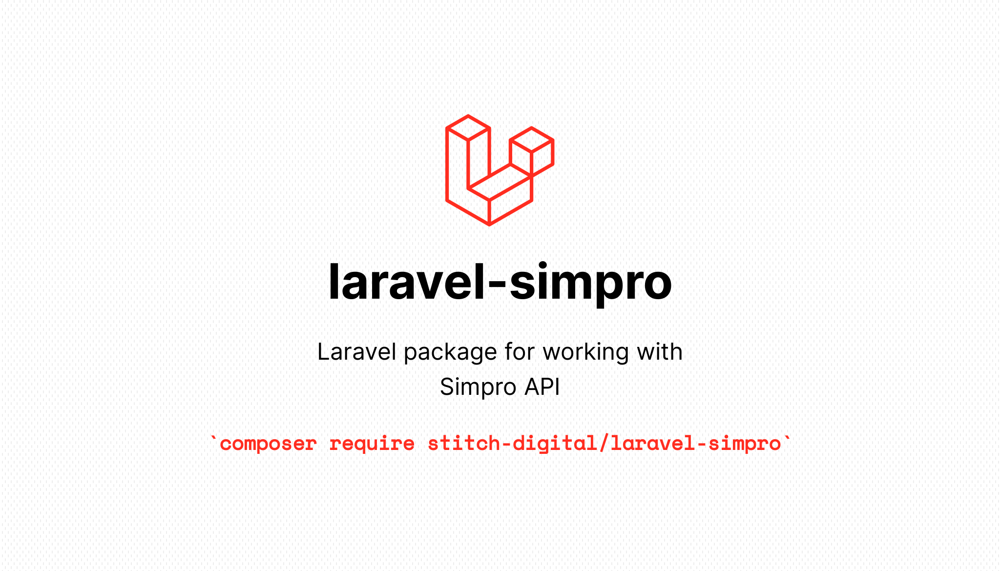

# Laravel package for working with Simpro API

Laravel Simpro is a robust package designed to seamlessly integrate your Laravel application with the Simpro API. This package simplifies the process of connecting to the Simpro API, allowing you to focus on building your application's core features without worrying about the underlying API complexities.

Check out the full documentation for this package at: [https://stitch-digital.github.io/laravel-simpro/](https://stitch-digital.github.io/laravel-simpro/).

The full Simpro API documentation can be [found here](https://developer.simprogroup.com/apidoc/).

## Changelog

Please see [CHANGELOG](CHANGELOG.md) for more information on what has changed recently.

## Contributing

Contributions are welcome and will be fully credited.

Contributions are accepted via Pull Requests on [Github](https://github.com/stitch-digital/laravel-simpro).

## Making Pull Requests

- **One pull request per feature** - If you are looking to work on multiple things, please submit multiple pull requests.
- **Update documentation** - Our documentation is located in the /docs directory. Please ensure that if you are making a change that you also review the documentation and include revisions to the docs in your pull request.

## Security Vulnerabilities

If you discover any security related issues, please email [support@stitch-digital.co](mailto:support@stitch-digital.co) instead of using the issue tracker.

## Credits

- [John Trickett](https://github.com/johntrickett86)
- [All Contributors](../../contributors)

## License

The MIT License (MIT). Please see [License File](LICENSE.md) for more information.
