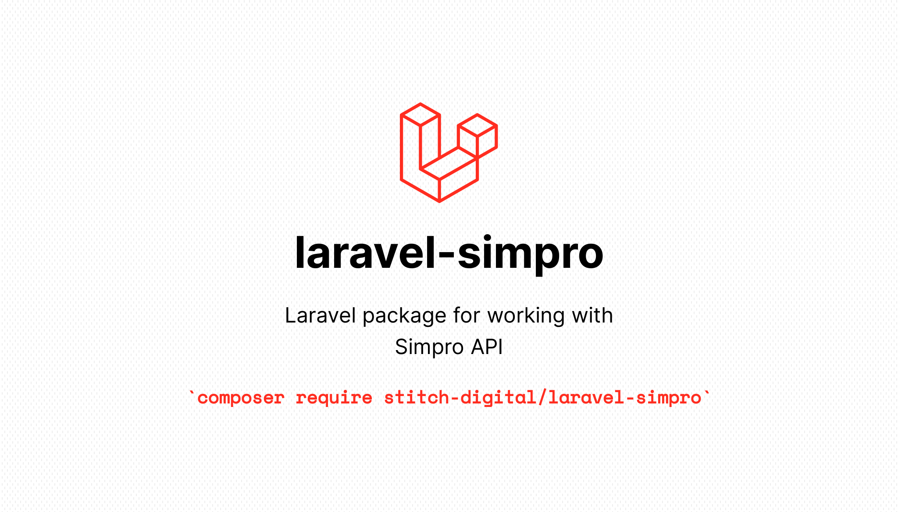

# Laravel package for working with Simpro API

Laravel Simpro is a robust package designed to seamlessly integrate your Laravel application with the Simpro API. This package simplifies the process of connecting to the Simpro API, allowing you to focus on building your application's core features without worrying about the underlying API complexities.

The full Simpro API documentation can be [found here](https://developer.simprogroup.com/apidoc/).

## Getting Started

* [Installation](getting-started/installation.md)
